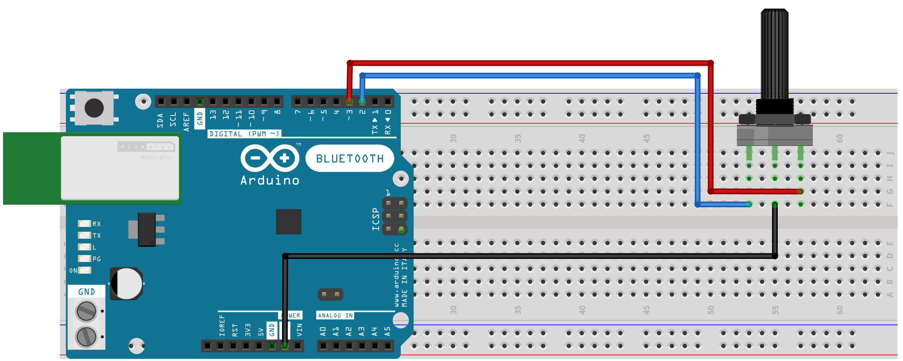

RobustQuadrature
================

[](https://github.com/wagenadl/RobustQuadrature/actions/workflows/arduino.yml)

An Arduino library for robustly reading quadrature encoders

The RobustQuadrature library can be used to read quadrature encoders
(including rotary encoders such as PEC11R). What sets this library
apart from several others with similar goals is its robustness in the
face of jitter.

Example
-------



It is not necessary to put capacitors or pull-up resistors on the
board. Any standard 3-pin rotary encoder (e.g., Bourns PEC11R) should
do the job. If your rotary encoder has a built-in switch as well, you
can separately connect that any way you want.

```
#include <RobustQuadrature.h>

RobustQuadrature::One<2, 3> encoder;

int pos0;

void setup() {
  Serial.begin(115200);
  while (!Serial) {
  }
  Serial.println("RobustQuadrature demo");
  pos0 = 0;
}

void loop() {
  int pos = encoder.position();
  if (pos != pos0) {
    Serial.println(pos);
    pos0 = pos;
  }
}
```

This sketch reports the position of the encoder whenever it changes,
measuring one step per cycle.

Why this library is better
--------------------------

In an ideal world, a quadrature encoder would provide sharp and clean
zero volt to five volt (or 3.3 V) transitions and vice versa. In the
real world, this is rarely the case. Because these devices contain
physical contacts, the output voltage often jumps up and down several
times for a single nominal transition. This is called jitter, and can
cause miscounting. The RobustQuadrature library avoids this confusion
by measuring the state of each pin only during the transition of the
other pin, and not during its own transition. Once a transition is
detected on a pin, no further transitions on that same pin are
considered until a transition on the other pin has occurred.


Usage
------

The template class `RobustQuadrature::One` is used to read out the
position from a quadrature encoder, reporting one step per quadrature
cycle (at the rising edge of the first pin). It takes two template
arguments, being the pins connected to the encoder. You can read out
the position of the encoder at any time using the `position()` method,
which returns a `long int`.

The template class `RobustQuadrature::Two` reports two steps per
quadrature cycle, at both rising and falling edges of the first
pin. For instance:

```
RobustQuadrature::Two<4, 5> encoder45;
```

The template class `RobustQuadrature::Four` reports four steps per
quadrature cycle, at both rising and falling edges of the first pin
and at both rising and falling edges of the second pin. For instance:

```
RobustQuadrature::Four<8, 9> encoder89;
```

Fine tuning
-----------

No fine tuning is required for `RobustQuadrature::One`. However, for
`RobustQuadrature::Two` and `RobustQuadrature::Four`, there is a
*holdoff* parameter that can be tuned. To understand the meaning of
this parameter, we have to consider the function of a quadrature
encoder in a little more detail.

As long as the encoder is turned consistently in the same direction,
*A* and *B* edges should alternate, and our readout scheme is indeed
robust. However, if the direction is reversed after a *A* edge, there
will be another *A* edge (of opposite polarity) before there is a *B*
edge. This would cause the algorithm as described to ignore that edge. 

In the case of `RobustQuadrature::One`, this does not matter, as that
falling edge would not be reported anyway, but in the case of
`RobustQuadrature::Two` and `RobustQuadrature::Four`, this would cause a
missed pulse. To avoid this problem, these classes detect repeated *A*
edges if a “holdoff period” has expired. This period defaults to
1000 µs (1 ms), which is suitable in many real-world applications. If
your application suffers missed pulses, you can reduce the holdoff
period using the `setHoldoff()` method, which takes a parameter in
microseconds. Conversely, if your application suffers spurious
detections, you can increase the holdoff period.

Callbacks
---------

Optionally, you can specify a callback function to receive notification
whenever the position changes. For instance:

```
void reporter(unsigned long pos) {
  // do stuff here
}

RobustQuadrature::One<2, 3> encoder;

void setup() {
  encoder.setCallback(reporter);
}
```

A word of caution: the function is called from within an interrupt
service routine (ISR). That means that you should return quickly and
that some functionality is limited. See the notes on the [Arduino
website](https://docs.arduino.cc/language-reference/en/functions/external-interrupts/attachInterrupt#interrupt-service-routines-isr").

Note on usable pins
-------------------

Both of the Arduino pins must be capable of generating interrupts. On
the Arduino UNO, the means you are restricted to using pins D2 and D3
only. Other MCUs tend to be (much) less restrictive. For boards
manufactured by Arduino, the table on the [reference page for
attachInterrupt()](https://docs.arduino.cc/language-reference/en/functions/external-interrupts/attachInterrupt/)
provides details. When in doubt, consider writing a test sketch
containing something like

```
void setup() {
  Serial.start(115200);
  if (RobustQuadrature::valid<2, 3>()) {
    Serial.println("The pin pair (2,3) is valid on this hardware");
  } else {
    Serial.println("The pin pair (2,3) is not valid on this hardware");
  }
}
```

before soldering anything into final form.

Finally, if the pins do not have the ability to use an internal
pull-up resistor (most MCUs do have this ability for all pins), you
may have to attach external pull-up resistors. Suitable values might
be in the range of 10 to 50 kOhm.
