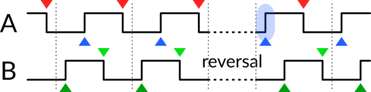

RobustQuadrature
================

[](https://github.com/wagenadl/RobustQuadrature/actions/workflows/arduino.yml)

An Arduino library for robustly reading quadrature encoders

The RobustQuadrature library can be used to read quadrature encoders
(including rotary encoders such as PEC11R). What sets this library
apart from several others with similar goals is its robustness in the
face of jitter.

Example
-------


Any standard 3-pin rotary encoder (e.g., Bourns PEC11R) should do the
job. It is not necessary to put capacitors or pull-up resistors on the
board: the whole reason for this library to exist is to make it
possible to use rotary encoders with zero additional electronics.

If your rotary encoder has a built-in switch as well, you can
separately interface to that any way you want, e.g., using the
[PushButton](https://github.com/pololu/pushbutton-arduino) library
from Pololu.

```
#include <RobustQuadrature.h>

RobustQuadrature::One<2, 3> encoder;

int pos0;

void setup() {
  Serial.begin(115200);
  while (!Serial) {
  }
  Serial.println("RobustQuadrature demo");
  pos0 = 0;
}

void loop() {
  int pos = encoder.position();
  if (pos != pos0) {
    Serial.println(pos);
    pos0 = pos;
  }
}
```

This sketch reports the position of the encoder whenever it changes,
measuring one step per cycle.

Advantages of using this library
--------------------------

* The readout is robust in the sense that no pulses are lost if you
  only call the `position()` method infrequently. Internally, that is
  achieved by relying on interrupts to monitor state transitions of
  the encoder.

* The readout is also robust in the sense that it is insensitive to
  jitter in the state transitions: In an ideal world, a quadrature
  encoder would provide sharp and clean zero volt to five volt (or 3.3
  V) transitions and vice versa. In the real world, this is rarely the
  case. Because these devices contain physical contacts, the output
  voltage often jumps up and down several times for a single nominal
  transition. This is called jitter, and can cause miscounting. The
  RobustQuadrature library avoids this confusion by measuring the
  state of each pin only during the transition of the other pin, and
  not during its own transition. Once a transition is detected on a
  pin, no further transitions on that same pin are considered until a
  transition on the other pin has occurred. This algorithm has the
  benefit that it is entirely insensitive to the speed of rotation.

* The library supports reporting one, two, or four steps per
  quadrature cycle.

* On microcontrollers that support interrupts on multiple pins, you
  can instantiate multiple RobustQuadrature decoders at near-zero cost
  in CPU load, because the library does not rely on polling for
  detecting state transitions.

* The library is fully implemented in a single C++ header file using
  templates. You can install it through the Arduino Library Manager,
  or ship the header file file with your project. A secondary
  advantage of this structure is that only the features you actively
  use are compiled and linked into your firmware.

Usage
------

The template class `RobustQuadrature::One` is used to read out the
position from a quadrature encoder, reporting one step per quadrature
cycle (at the rising edge of the first pin). It takes two template
arguments, being the pins connected to the encoder. For instance:

```
RobustQuadrature::One<2,3> encoder;
```

for the physical setup in the example above.

You can read out the position of the encoder at any time using the
`position()` method, which returns a `long int`. To convert position
to number of rotations, divide by the “pulses per rotation” number
specified in the datasheet of your encoder. In most cases, that number
refers to the number of full A+/B+/A–/B– cycles per rotation, but it
doesn't hurt to read the fine print.

The template class `RobustQuadrature::Two` reports two steps per
quadrature cycle, at both rising and falling edges of the first
pin. Like `RobustQuadrature::One`, it takes two template
arguments, being the pins connected to the encoder. For instance:

```
RobustQuadrature::Two<4, 5> encoder45;
```

The template class `RobustQuadrature::Four` reports four steps per
quadrature cycle, at both rising and falling edges of the first pin
and at both rising and falling edges of the second pin. For instance:

```
RobustQuadrature::Four<8, 9> encoder89;
```

Fine tuning to avoid a missed pulse upon reversal
-------------------------------------------------

In most cases, no fine tuning is required to make the library
work. The only situation where fine tuning may be needed, is if it is
unacceptable to occasionally miss a single edge during reversal of
direction. Even then, `RobustQuadrature::One` does not need any fine
tuning when used with a rotary encoder that has detents once per
cycle.

To understand the problem and its solution, we have to consider the
functioning of a quadrature encoder in some detail. The
diagram below shows the time course of the edges reported by the
encoder before and after a reversal of direction. The thin dashed
lines indicate the position of detents, if your encoder has them.



`RobustQuadrature::One` only reports the falling A edges (red
markers). `RobustQuadrature::Two` additionally reports the rising A
edges (blue markers). `RobustQuadrature::Four` also reports the rising
and falling B edges (green markers).

As long as the encoder is turned consistently in the same direction,
A+/B+/A–/B– edges should alternate, and our readout scheme is indeed
robust. However, if the direction is reversed after a falling A edge,
there will be rising A edge before there is a B edge. This would cause
the algorithm as described to ignore that edge (highlighted in blue
above).

In the case of `RobustQuadrature::One`, this does not matter, as that
rising edge would not be reportable anyway, but in the case of
`RobustQuadrature::Two` and `RobustQuadrature::Four`, this would cause
a missed pulse. And for encoders without detents, where reversal can
occur while A is high, even `RobustQuadrature::One` can miss the first
edge after reversal.

To avoid this problem, the library supports reporting repeated edges if
a “holdoff period” has expired. For `RobustQuadrature::Two` and
`RobustQuadrature::Four` this period defaults to 1000 µs (1 ms), which
is suitable in many real-world applications. If your application
suffers missed pulses, you can reduce the holdoff period using the
`setHoldoff()` method, which takes a parameter in
microseconds. Conversely, if your application suffers spurious
detections, you can increase the holdoff period, or disable the feature
entirely by `setHoldoff(0)`.  For `RobustQuadrature::One`, the
feature is disabled by default, but can be enabled using the
`setHoldoff()` method with a nonzero argument.

To be clear, the *holdoff* parameter does not limit how fast
consecutive edges can be detected on the two channels during
continuous rotation; it only comes into play during reversal of
direction. This means that the precise value of the parameter is not
important unless you have extremely rapid reversals.

Callbacks
---------

Optionally, you can specify a callback function to receive notification
whenever the position changes. For instance:

```
void reporter(unsigned long pos) {
  // do stuff here
}

RobustQuadrature::One<2, 3> encoder;

void setup() {
  encoder.setCallback(reporter);
}
```

A word of caution: the function is called from within an interrupt
service routine (ISR). That means that you should return quickly and
that some functionality is limited. See the notes on the [Arduino
website](https://docs.arduino.cc/language-reference/en/functions/external-interrupts/attachInterrupt#interrupt-service-routines-isr").

Note on usable pins
-------------------

Both of the Arduino pins must be capable of generating interrupts. On
the Arduino UNO, the means you are restricted to using pins D2 and D3
only. Other MCUs tend to be (much) less restrictive. For instance, the
Raspberry Pi Pico MCUs support interrupts on all pins.

For boards
manufactured by Arduino, the table on the [reference page for
attachInterrupt()](https://docs.arduino.cc/language-reference/en/functions/external-interrupts/attachInterrupt/)
provides details. When in doubt, consider writing a test sketch
containing something like

```
void setup() {
  Serial.start(115200);
  if (RobustQuadrature::valid<2, 3>()) {
    Serial.println("The pin pair (2,3) is valid on this hardware");
  } else {
    Serial.println("The pin pair (2,3) is not valid on this hardware");
  }
}
```

before soldering anything into final form.

Finally, if the pins do not have the ability to use an internal
pull-up resistor (most MCUs do have this ability for all pins, but
some ESP32-based devices have idiosyncratic restrictions on certain
pins), you may have to attach external pull-up resistors. Suitable
values might be in the range of 10 to 50 kOhm.
